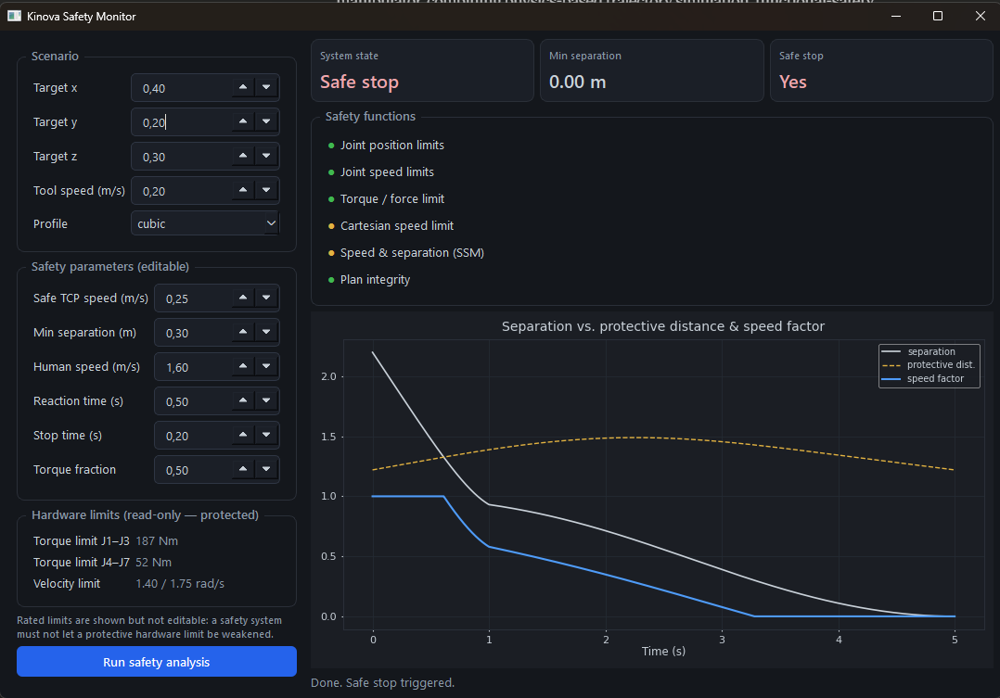
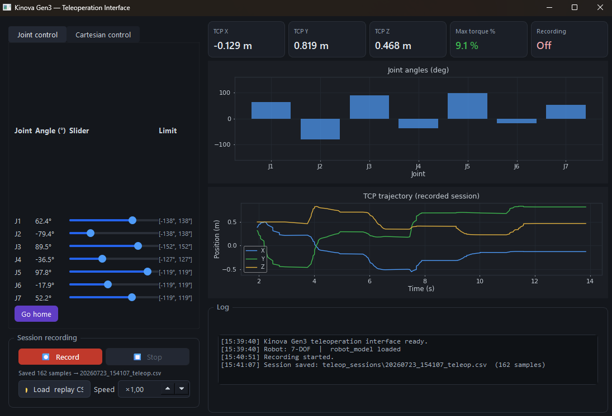

# Kinova Gen3 — Simulation, Safety & Teleoperation Platform


A comprehensive robotics engineering platform for the **7-DOF Kinova Gen3** manipulator,
combining physics-based trajectory simulation, functional-safety monitoring, and
interactive teleoperation — all implemented in Python and MATLAB/Simulink.

| Capability | Entry point | Requires MATLAB |
|---|---|---|
| CTC trajectory simulation | `kinova_app.py` / `KinovaApp.m` | Yes |
| Functional-safety monitor | `python -m safety.safety_dashboard` | Yes (for trajectory) |
| Teleoperation interface | `python kinova_teleop.py` | No |

---

## Key results

| Metric | Value |
|---|---|
| RMS tracking error | **0.0158° – 0.0160°** |
| Max joint error | **0.0967° – 0.0976°** |
| Final EE position error | **0.048 mm** |
| TCP path deviation (9-waypoint test) | **0.079 mm max** |
| Safety requirements verified | **18 / 18 pass** |
| Teleoperation session export | CSV + MAT |

---

## 1. CTC Trajectory Simulator

A physics-based digital twin of the Kinova Gen3 with a Computed Torque Controller
running on full nonlinear robot dynamics — not a kinematics approximation.

### Controller

```
τ = M(q) · [q̈_ff + Kp·e + Kd·ė]  +  C(q,q̇)  +  G(q)
```

`M(q)`, `C(q,q̇)`, and `G(q)` are computed live from the robot's actual
configuration at every timestep. Substituting into the equation of motion gives
closed-loop error dynamics `ë + Kd·ė + Kp·e = 0` — a damped second-order system.
Gains are chosen so every joint is overdamped, which is why tracking error stays
under 0.1° with no oscillation.

### Two interfaces, one validated controller

The same `KinovaCollisionFree.slx` Simscape model is driven from both a
**MATLAB App Designer GUI** and a **Python/PyQt6 GUI** (via the MATLAB Engine API).
Both produce independently cross-validated, matching results.

<table>
<tr><th>MATLAB GUI</th><th>Python GUI</th></tr>
<tr>
<td></td>
<td></td>
</tr>
<tr>
<td align="center">RMS 0.0158° · Energy 12.19 J · Safety 100/100</td>
<td align="center">RMS 0.0160° · Energy 10.27 J · Safety 100/100</td>
</tr>
</table>

### Trajectory profiles

Four profiles tested against the same target:

| Profile | RMS Error (°) | Max Error (°) | Energy (J) |
|---|---|---|---|
| Cubic Spline | **0.0160** | **0.0987** | **10.25** |
| Quintic Polynomial | 0.0172 | 0.1189 | 10.36 |
| Trapezoidal (LSPB) | **0.0160** | **0.0987** | **10.25** |
| Bang-Bang | 0.0166 | 0.1119 | 10.38 |

Cubic Spline and LSPB are jointly optimal. Quintic — the smoothest kinematically —
produces the highest CTC tracking error because its higher peak velocity increases
Coriolis coupling between joints.

### Independent validation

`validateKinovaResults.m` re-derives every key result outside the GUI across
7 structured checks: tracking error, energy, FK end-effector pose, joint limits,
torque saturation, Robotics Toolbox cross-check, and data integrity.
All 7 pass independently of the GUI that generated the results.

---

## 2. Functional-Safety Monitoring Layer

An **independent** safety monitor developed through the functional-safety lifecycle
(ISO 12100, ISO 10218, ISO/TS 15066). It reads the robot model and trajectory
read-only and changes nothing in the control code — following the principle of
freedom from interference between the safety and functional channels.



### Safety functions implemented

| Function | Standard | Threshold |
|---|---|---|
| Joint position limits | ISO 13849 | Hardware `Q_LIM` |
| Joint velocity limits | ISO 10218 | Hardware `QD_MAX` |
| Torque / Power & Force Limiting | ISO/TS 15066 | 50% of rated `TAU_MAX` |
| Cartesian TCP speed limit | ISO/TS 15066 | 0.25 m/s |
| Speed & Separation Monitoring (SSM) | ISO/TS 15066 | Dynamic S_p formula |
| Plan integrity | ISO 13849 | No NaN/Inf, monotonic time |
| Safe stop (latching) | ISO 13849 | On any hard violation |

### Speed & Separation Monitoring — the showpiece

The monitor continuously computes the dynamic protective separation distance:

```
S_p = v_H·(T_r + T_s) + v_R·T_r + v_R²/(2·a_R) + (C + Z)
```

As a simulated human approaches, the robot speed is progressively scaled and
ultimately halted when separation drops below the protective distance.
The dashboard visualises separation, S_p, and the speed factor live.

All safety parameters (safe speed, protective distance, reaction time, torque
fraction) are **user-editable**. Rated hardware limits are shown **read-only** —
a safety system must not allow a protective hardware limit to be weakened.

### Safety documentation

Seven structured safety-lifecycle documents are provided in `safety/docs/`:

| Document | Content |
|---|---|
| `01_item_definition.md` | System boundary, operating modes, signal list |
| `02_hara.md` | 9 hazards, S/F/P ratings, PLr per ISO 13849-1 |
| `03_safety_requirements.md` | 19 numbered, traceable requirements |
| `04_fmea.md` | 12 failure modes of the safety layer, RPN analysis |
| `05_fta.md` | Fault tree for the top hazard (PLr e) |
| `06_verification_validation.md` | 18 verification procedures — all pass |
| `07_safety_case.md` | Structured safety argument (claims C1–C6) |

Full traceability: **Hazard → Safety goal → Requirement → Verification → Result**.

> **Scope.** This is a concept demonstration applying functional-safety methods
> to a simulated robot. It is not a certified or standards-compliant safety system.
> Thresholds are illustrative ISO/TS 15066 defaults, not from a certified
> biomechanical assessment.

---

## 3. Teleoperation Interface

A standalone teleoperation GUI for manual operation and data collection — no MATLAB
required. Opens immediately and runs against `robot_model.py` for real-time
kinematics.



### Control modes

**Joint control** — seven sliders drive each joint directly, with real-time angle
readout and hardware limits displayed. A "Go home" button resets all joints.

**Cartesian control** — set an (x, y, z) target and orientation; the GUI solves IK
in a background thread and drives the joint sliders to the solution automatically.

### Session recording and export

Press **Record**, operate the arm, press **Stop**. The session is saved to
`teleop_sessions/` as:

- `<timestamp>_teleop.csv` — human-readable; importable into Excel, pandas, MATLAB.
- `<timestamp>_teleop.mat` — directly loadable by `validateKinovaResults.m`.

**Replay** — load any saved CSV and play it back at adjustable speed (0.1×–5×),
with the sliders animating and the TCP trajectory plot updating live.

### Live telemetry

Five status cards update in real time: TCP X, Y, Z position; max joint torque as a
percentage of rated (green / amber / red); and recording status. A bar chart shows
all 7 joint angles simultaneously; the TCP trajectory plot shows the path traced
during the current or most recently loaded session.

---

## Architecture

```
┌─────────────────────────────────────────────────────────────┐
│                    Kinova Platform                          │
│                                                             │
│  kinova_app.py ──────────────────┐                         │
│  KinovaApp.m    (simulation GUI) │                         │
│                                  ▼                         │
│                    KinovaCollisionFree.slx                  │
│                    Simscape Multibody CTC                   │
│              τ = M(q)·[q̈_ff + Kp·e + Kd·ė] + C + G       │
│                           │                                 │
│                    Q_out (joint angles)                     │
│                    ┌──────┴──────┐                          │
│                    ▼             ▼                          │
│            Results/Plots   validateKinovaResults.m          │
│                                                             │
│  kinova_teleop.py  (standalone, no MATLAB)                  │
│  └── robot_model.py  FK / IK / dynamics                    │
│  └── Session logger  CSV + MAT export                      │
│                                                             │
│  safety/safety_dashboard.py  (independent observer)        │
│  └── safety_monitor.py   19 requirements                   │
│  └── human_model.py      simulated operator (SSM)          │
│  └── docs/               7 safety-lifecycle documents      │
└─────────────────────────────────────────────────────────────┘
```

---

## Requirements

**MATLAB** (for simulation and safety dashboard): R2024a+, Simulink,
Simscape Multibody, Robotics System Toolbox.

**Python** (3.9–3.12):
```bash
pip install PyQt6 PySide6 roboticstoolbox-python numpy scipy matplotlib matlabengine==25.2.2
```
(`matlabengine` version must match your installed MATLAB release.
The teleoperation GUI requires only `PySide6 roboticstoolbox-python numpy scipy matplotlib`.)

---

## Quick start

```matlab
% MATLAB — trajectory simulation
KinovaApp
```

```bash
# Python — trajectory simulation (requires MATLAB running)
python kinova_app.py

# Teleoperation interface (no MATLAB required)
python kinova_teleop.py

# Functional-safety dashboard (requires MATLAB for trajectory generation)
python -m safety.safety_dashboard
```

---

## Project structure

```
kinova-gen3-ctc-simulator/
│
├── KinovaCollisionFree.slx            Simscape Multibody CTC model
│
├── kinova_app.py                      Python trajectory GUI (PyQt6)
├── kinova_teleop.py                   Teleoperation interface (PySide6)
├── robot_model.py                     FK, IK, M/C/G dynamics
├── generate_trajectory.py             5 trajectory profiles
├── generate_multi_waypoint.py         Cubic Hermite multi-waypoint
├── simulink_bridge.py                 Python → MATLAB Engine → Simulink
│
├── KinovaApp.m                        MATLAB App Designer GUI
├── generateTrajectory.m               5 trajectory profiles (MATLAB)
├── generateMultiWaypoint.m            Cubic Hermite (MATLAB)
├── generateTrajectoryTaskSpace.m      Task-space SLERP (MATLAB)
├── validateKinovaResults.m            7-section independent validation
│
├── safety/
│   ├── safety_dashboard.py            Functional-safety GUI (PySide6)
│   ├── safety_monitor.py              19-requirement safety monitor
│   ├── safety_runner.py               Trajectory analysis runner
│   ├── human_model.py                 Simulated operator (SSM)
│   └── docs/
│       ├── 01_item_definition.md
│       ├── 02_hara.md
│       ├── 03_safety_requirements.md
│       ├── 04_fmea.md
│       ├── 05_fta.md
│       ├── 06_verification_validation.md
│       └── 07_safety_case.md
│
├── images/
├── .github/workflows/ci.yml           CI: byte-compile Python 3.9–3.12
├── README.md
└── LICENSE
```

---

## Hardware specifications — Kinova Gen3 7-DOF

| Joint | Torque limit | Velocity limit | Position limit |
|---|---|---|---|
| J1–J3 | 187 Nm | 1.396 rad/s | ±138.1° / ±152.4° |
| J4–J7 | 52 Nm | 1.745 rad/s | ±127.8° / ±119.7° |

---

## Attribution

The Simscape Multibody kinematic structure uses Kinova Gen3 geometry derived from
MathWorks example resources. The Computed Torque Control loop, trajectory planners,
independent validation framework, functional-safety monitoring layer, and
teleoperation interface are original work.

---

## Author

**Smithil Wadkar** — [GitHub @Smithil23](https://github.com/Smithil23)

## License

MIT License — see [LICENSE](LICENSE).
