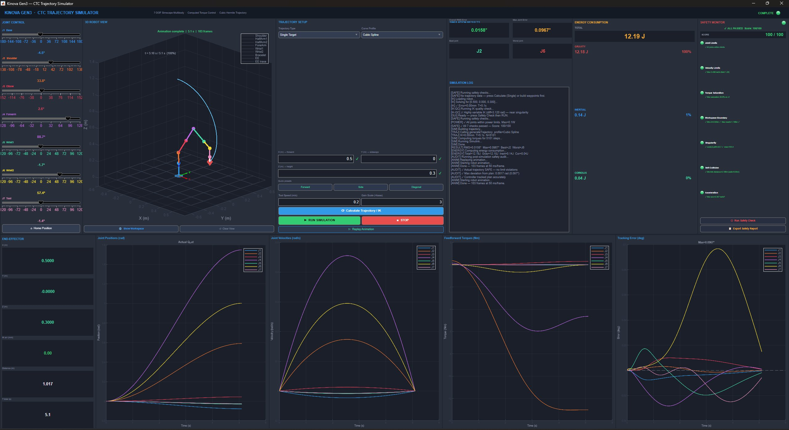
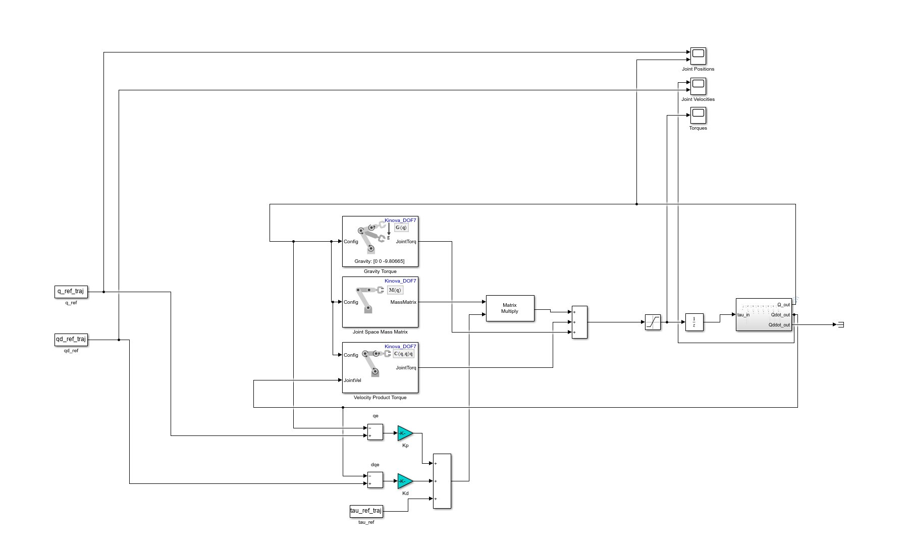
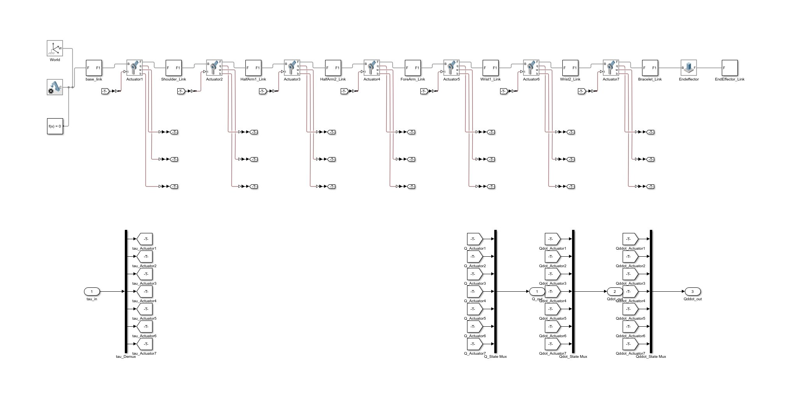
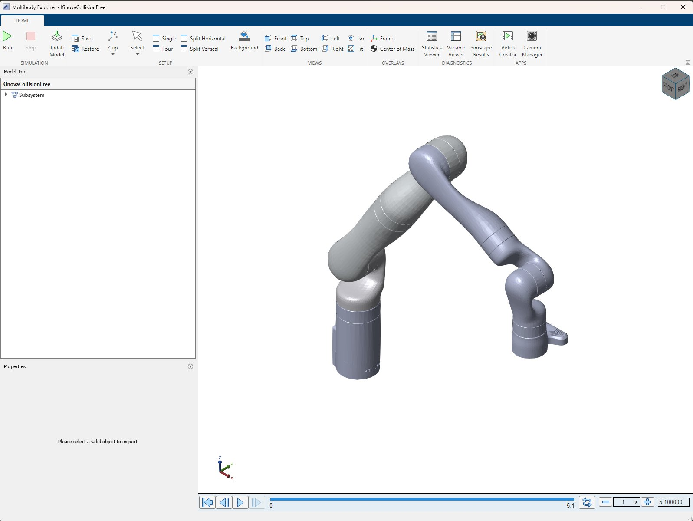
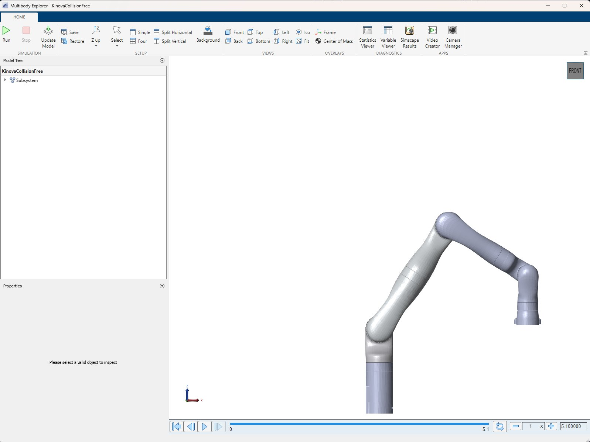
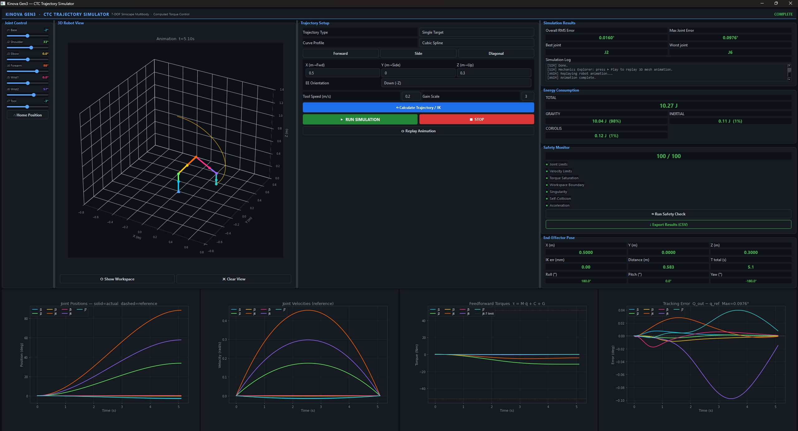
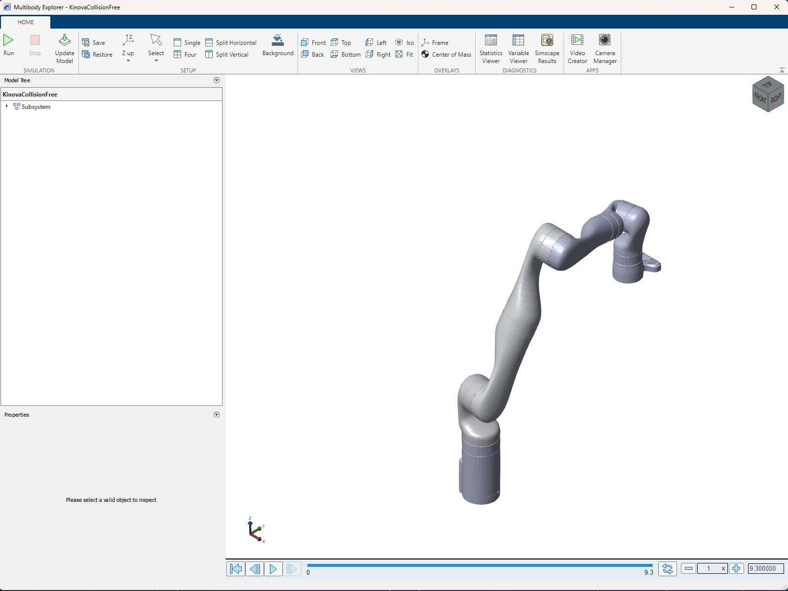
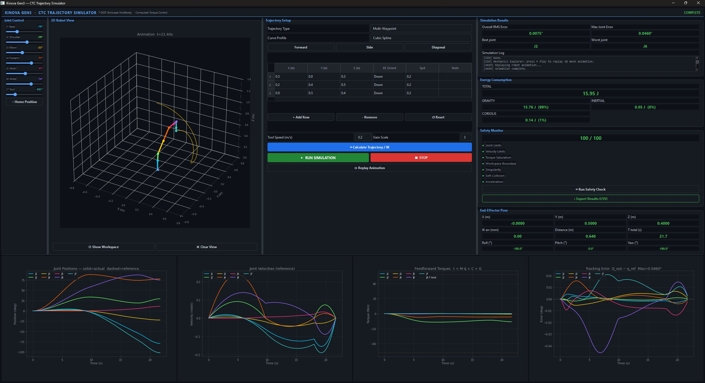

# Kinova Gen3 CTC Trajectory Simulator


A 7-DOF Kinova Gen3 robot trajectory simulator implementing **Computed Torque Control (CTC)**, with dual MATLAB and Python interfaces, full Simscape Multibody physics, and independently validated results.



| Metric | Value |
|---|---|
| RMS tracking error | **0.0158° – 0.0160°** |
| Max joint error | **0.0967° – 0.0976°** |
| Final EE position error | **0.048 mm** |
| TCP path deviation (9-waypoint test) | **0.079 mm max** |
| Safety score | **100 / 100** |
| Energy (gravity-dominated) | **98–99%** |

Both implementations — MATLAB App Designer and Python PyQt6 — drive the same Simulink/Simscape model and produce matching results.

---

## What this proves

A trajectory is planned in joint space, sent through a Computed Torque Controller running on full nonlinear robot dynamics (mass matrix, Coriolis forces, gravity), simulated in Simscape Multibody with real rigid-body physics, and the result is independently re-verified outside the GUI. This is not a kinematics-only demo — it is a working real-time control loop validated against the underlying mechanics.

---

## CTC Controller — built and verified



The controller computes:

```
τ = M(q) · [q̈_ff + Kp·e + Kd·ė]  +  C(q,q̇)  +  G(q)
```

where `M(q)` is the joint-space mass matrix, `C(q,q̇)` is the Coriolis/centrifugal torque, and `G(q)` is the gravity torque — all computed live from the robot's actual configuration at every timestep, not approximated. Substituting the control law into the equation of motion gives closed-loop error dynamics `ë + Kd·ė + Kp·e = 0`, a damped second-order system. Gains are chosen so every joint is overdamped, which is why tracking error stays under 0.1° with no oscillation.

The full kinematic chain — base through 7 actuated joints to the end effector, with torque sensors on every joint — is modelled explicitly in Simscape:



---

## Real physics, not just plots

Mechanics Explorer renders the actual rigid-body simulation, confirming the GUI plots correspond to real Simscape dynamics rather than a kinematic approximation.

<table>
<tr>
<td></td>
<td></td>
</tr>
<tr>
<td align="center">MATLAB-driven simulation, t = 5.1s</td>
<td align="center">Python-driven simulation, t = 5.1s (same model, same controller)</td>
</tr>
</table>

---

## Simulation in motion


---

## Two interfaces, one validated controller

The same `KinovaCollisionFree.slx` model is driven from both a MATLAB App Designer GUI and a Python PyQt6 GUI (Python calls MATLAB/Simulink via the engine API). Both produce matching results on identical tasks.

<table>
<tr><th>MATLAB GUI</th><th>Python GUI</th></tr>
<tr>
<td></td>
<td></td>
</tr>
<tr><td align="center">RMS 0.0158° · Energy 12.19J · Safety 100/100</td><td align="center">RMS 0.0160° · Energy 10.27J · Safety 100/100</td></tr>
<tr>
<td></td>
<td></td>
</tr>
<tr><td align="center">RMS 0.0168° · 3 waypoints · 0.00mm IK error each</td><td align="center">RMS 0.0075° · 3 waypoints · 0.00mm IK error each</td></tr>
</table>

---

## Trajectory profile comparison

Four trajectory profiles were tested against the CTC controller on the same target to determine which is best tracked:

| Profile | RMS Error (°) | Max Error (°) | Energy (J) |
|---|---|---|---|
| Cubic Spline | **0.0160** | **0.0987** | **10.25** |
| Quintic Polynomial | 0.0172 | 0.1189 | 10.36 |
| Trapezoidal (LSPB) | **0.0160** | **0.0987** | **10.25** |
| Bang-Bang | 0.0166 | 0.1119 | 10.38 |

Cubic Spline and LSPB are jointly optimal. Counterintuitively, Quintic — the smoothest profile kinematically — produces the highest CTC tracking error, because its higher peak velocity increases Coriolis coupling between joints. Bang-Bang uses the most energy due to its aggressive acceleration profile.

---

## Architecture

```
Python GUI (PyQt6)              MATLAB GUI (App Designer)
       │                                  │
       ▼                                  ▼
 Trajectory Planner                Trajectory Planner
  IK → q_ref, qd_ref, q̈_ff         IK → q_ref, qd_ref, q̈_ff
       │                                  │
       └────────────────┬─────────────────┘
                        ▼
            KinovaCollisionFree.slx
            Simscape Multibody CTC
       τ = M(q)·[q̈_ff + Kp·e + Kd·ė] + C + G
                        │
                        ▼
                Q_out (joint angles)
                        │
        ┌───────────────┴───────────────┐
        ▼                               ▼
  Results + Plots                 Independent Validation
  Energy / Safety                 7-section numerical check
```

---

## Independent validation

`validateKinovaResults.m` re-derives every key result outside the GUI:

1. Tracking error recomputed directly from raw `Q_out`
2. Energy recomputed from full CTC dynamics
3. Forward kinematics on final `Q_out` → EE position error
4. All joints checked against hardware position limits
5. Max torque compared against rated torque (no saturation)
6. Simulink output cross-checked against Robotics Toolbox FK
7. Data integrity check (no NaN/Inf, monotonic time)

All 7 sections pass independently of the GUI that generated the results.

---

## TCP accuracy test

A 3×3 grid of 9 waypoints spanning the robot's reachable workspace, tested end-to-end:

- All 9 waypoints **PASS** (under 2mm threshold)
- Max EE deviation: **0.079 mm**
- RMS EE deviation: **0.026 mm**

---

## Project structure

```
kinova-gen3-ctc-simulator/
│
├── KinovaCollisionFree.slx           Simscape Multibody CTC model (shared)
│
├── MATLAB
│   ├── KinovaApp.m                   App Designer GUI
│   ├── generateTrajectory.m          5 trajectory profiles
│   ├── generateMultiWaypoint.m       Cubic Hermite multi-waypoint
│   ├── generateTrajectoryTaskSpace.m Task-space SLERP trajectories
│   └── validateKinovaResults.m       7-section independent validation
│
├── Python
│   ├── kinova_app.py                 PyQt6 GUI
│   ├── robot_model.py                FK, IK, M/C/G dynamics
│   ├── generate_trajectory.py        5 trajectory profiles
│   ├── generate_multi_waypoint.py    Cubic Hermite + junction velocities
│   └── simulink_bridge.py            Python → MATLAB engine → Simulink
│
├── images/
├── README.md
└── LICENSE
```

---

## Requirements

**MATLAB:** R2024a+, Simulink, Simscape Multibody, Robotics System Toolbox

**Python:**
```bash
pip install PyQt6 roboticstoolbox-python numpy scipy matplotlib matlabengine==25.2.2
```
(`matlabengine` version must match your installed MATLAB release.)

---

## Quick start

```matlab
% MATLAB
KinovaApp
```

```bash
# Python (requires MATLAB + KinovaCollisionFree.slx in working directory)
python kinova_app.py
```

---

## Hardware specifications — Kinova Gen3 7-DOF

| Joint | Torque limit | Velocity limit | Position limit |
|---|---|---|---|
| J1–J3 | 187 Nm | 1.396 rad/s | ±138.1° / ±152.4° |
| J4–J7 | 52 Nm | 1.745 rad/s | ±127.8° / ±119.7° |

---

## Author

**Smithil Wadkar** — [GitHub @Smithil23](https://github.com/Smithil23)

## License

MIT License — see [LICENSE](LICENSE).
